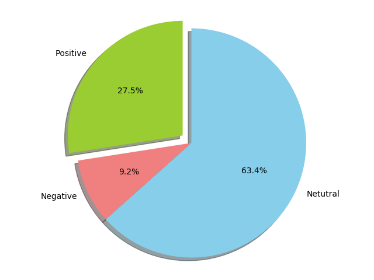
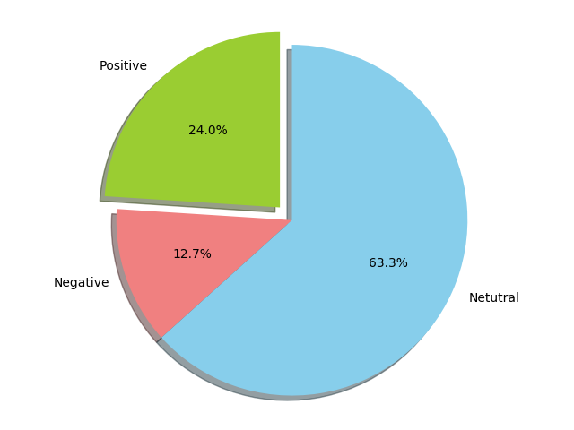

# Quora-Sentiment-Analysis
------------------------------------------

Used AFINN-111 to do sentiment-analysis on Quora answers and blogposts .

### Here's what i did
------------------------------------------
* Scraped answers and blogposts from [Quora](https://www.quora.com)  and conveted them into .txt format .
* Ignored
 1. [Stopwords](https://pythonspot.com/en/nltk-stop-words/)
 2. Non-Alpha characters [ # , % , * , ! .. ]
 3. Words which have no sentiment score defined [words , text , answer  ... ]
* Used the sentimental [score-carrying words](./about_AFINN.txt) in [AFINN-111.txt](./AFINN-111.txt) to deduce the overall sentiment of an answer or a blogpost .


### Samples
------------------------------------------

* [What are some good habits to follow?- Nelson Wang](https://www.quora.com/What-are-some-good-habits-to-follow)


* [Build a solid career in tech without a CS major - Aman Goels](https://amangoel.quora.com/Build-a-solid-career-in-tech-without-a-CS-major)


### Usage
------------------------------------------

```bash
        python3 main.py  [parameter]

        Parameters:
                pick_answer  - pick answer directly
                pick_profile - pick answers from profile
```

* Install requirements

```bash
pip install -r requirements.txt
```

### Known Issues
------------------------------------------

- [ ] No priority assigned to words occuring multiple times in the text . ( didn't get weights to assign :/ )     
- [ ] Text format contains words[upvotes , views , Sitemap] which should be part of an answer
- [ ] Ignored words for which scores aren't defined under AFINN-111.txt .

* Open for PR's and Issues .

### Enhancements
------------------------------------------

* Some of the words which aren't included under AFINN-111.txt are ignored ( assigned a score of 0 ) in this case, however we can deduce score for those words . for example , if the word `hit` always appears in the proximity of words like sad or unhappy , then we can conclude that the word `hit` carries a negative sentiment . [supporting paper](http://www.cs.cmu.edu/%7Enasmith/papers/oconnor+balasubramanyan+routledge+smith.icwsm10.pdf)


### Note
------------------------------------------

* The answers referenced under samples are picked up randomly  .
